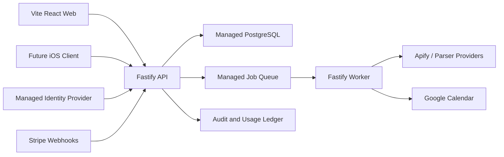

# Tracker Supreme v2 — product and architecture design

**Status:** approved design, ready for implementation planning
**Date:** 2026-06-20
**Canonical scope:** the future standalone `tracker-supreme-v2` repository
**Current location:** stored in the legacy repository only until the v2 repository is initialized

## 1. Executive summary

Tracker Supreme v2 is a new multi-tenant SaaS for managing recruiting and job-search pipelines. It serves both individuals and organizations. An individual can have a personal workspace and simultaneously belong to multiple organization workspaces.

The v2 product is a clean rewrite, not an incremental refactor of the current single-user application. It will live in a separate repository. The current application remains available as a read-only product reference until v2 reaches functional parity.

The selected architecture is:

- Vite, React, and TypeScript for the authenticated web application;
- a modular Fastify backend;
- managed PostgreSQL as the only source of truth;
- a managed identity provider for email, Google, Microsoft, and future enterprise SSO;
- a managed background-job service;
- a separate worker entry point for external integrations;
- Stripe Billing for commercial subscriptions;
- an internal entitlement engine for paid, promotional, and manually granted access;
- an extensible parser platform, initially backed by platform-managed Apify actors;
- Google Calendar as an optional OAuth integration;
- no Google Sheets integration in v2.

The normal first-year target is up to 1,000 active users. The design must remain comfortable up to 10,000 active users without changing the fundamental architecture. Initial production data resides in the EU. A workspace-level `home_region` prepares the system for a later US regional cell without imposing multi-region complexity on the initial release.

## 2. Goals

1. Replace the current single-user architecture with an isolated multi-tenant system.
2. Support personal and organization workspaces in the same account.
3. Make authorization, billing, parser access, and quotas server-enforced.
4. Keep operational work low through managed infrastructure without weakening data protection.
5. Make PostgreSQL the canonical data store and external services optional integrations.
6. Support platform-managed parsers now and organization-managed parser integrations later.
7. Meet GDPR-oriented privacy requirements and WCAG 2.2 AA accessibility requirements from the start.
8. Keep the API independent of the web framework so a future iOS client can use the same contract.
9. Deliver v2 in milestones that each end with a usable, testable system.

## 3. Non-goals for the initial release

- Google Sheets synchronization or export-specific development.
- Active-active global database replication.
- A native iOS application.
- Custom organization roles.
- Organization-provided Apify actors or arbitrary Web API parsers.
- Automatic metered overage billing.
- A public marketing site.
- Offline storage of customer data in the PWA.
- Migrating legacy data as part of normal application runtime.

Legacy migration is a separate, one-time operational task after the v2 schema is stable.

## 4. Product model

### 4.1 User and workspace model

A `user` represents a person and their external identity links. A `workspace` is the tenant and ownership boundary for product data.

Workspace kinds:

- `personal`: created for an individual and normally has one active member;
- `organization`: supports multiple members, centralized billing, shared data, and administration.

A person may own a personal workspace while also belonging to several organizations. The web application always operates in one explicit workspace context. Switching context changes the tenant scope for every subsequent query and mutation.

### 4.2 Initial roles

- `personal_user`: owner of a personal workspace;
- `organization_admin`: manages organization data, members, integrations, parser assignments, and billing;
- `organization_member`: works with organization recruiting data and explicitly permitted capabilities;
- `platform_admin`: server-side platform operations role reserved for the product owner and later trusted staff.

There is no viewer role in the initial release. Custom roles are intentionally deferred. The model uses stable permissions under the fixed roles so custom role composition can be introduced later without rewriting authorization checks.

### 4.3 Platform administration

`platform_admin` is not a hidden client feature and is never trusted because the UI conceals it. It is stored and enforced on the server, excluded from normal client identity payloads, protected by strong MFA or passkeys, and used through a separate administrative surface.

Platform administrators do not receive unconditional access to customer content. Support access is a temporary grant with:

- a documented reason;
- a target workspace;
- an expiration time;
- explicit re-authentication;
- a complete audit event;
- customer consent when required by policy, except documented security emergencies.

## 5. Repository and runtime boundaries

V2 is created as a separate repository adjacent to the legacy repository:

```text
tracker-supreme/       legacy application and temporary design record
tracker-supreme-v2/    new product repository
  apps/
    web/
    api/
    worker/
  packages/
    db/
    contracts/
    config/
```

Responsibilities:

- `apps/web`: authenticated Vite/React application and PWA shell;
- `apps/api`: Fastify HTTP API, authentication, authorization, domain commands, webhooks, and query endpoints;
- `apps/worker`: background consumers for parsers, Calendar operations, billing reconciliation, privacy jobs, and retries;
- `packages/db`: schema, migrations, query helpers, and tenant-safe transaction utilities;
- `packages/contracts`: OpenAPI schemas, generated TypeScript client, shared error types, and event payload contracts;
- `packages/config`: validated environment configuration and service capability flags.

`api` and `worker` are separate entry points with separate privileges. They may initially run on the same managed platform or deployment to reduce cost, but their code boundaries and database users remain distinct.

## 6. System architecture



The backend is a modular monolith rather than a microservice system. Modules communicate through explicit domain services and durable job or event contracts. They do not access each other's tables ad hoc.

Backend modules:

- `identity`: users, identity links, sessions, and account state;
- `tenancy`: workspaces, organizations, memberships, invitations, and region assignment;
- `pipeline`: hiring processes, contacts, events, and next actions;
- `authorization`: roles, permissions, membership capability overrides, and support access;
- `entitlements`: plan capabilities, manual grants, quotas, and effective-access evaluation;
- `parsers`: catalog, provider adapters, job lifecycle, normalization, and usage accounting;
- `integrations`: Google OAuth connections and Calendar synchronization;
- `billing`: Stripe customers, checkout, subscriptions, seats, and webhook reconciliation;
- `audit`: security, administrative, billing, export, and integration events;
- `privacy`: exports, deletion workflows, consent, and retention enforcement;
- `jobs`: queue dispatch, idempotency, retries, dead-letter handling, and scheduled work.

## 7. Data model

### 7.1 Identity and tenancy

- `users`
- `identity_links`
- `workspaces`
- `workspace_memberships`
- `workspace_invitations`
- `platform_admins`
- `support_access_grants`

Every tenant-owned table includes `workspace_id`. A personal workspace uses the same tenant rules as an organization workspace; it is not a special unscoped data path.

### 7.2 Recruiting domain

- `hiring_processes`
- `contacts`
- `process_contacts`
- `process_events`
- `process_blockers`
- `next_actions`
- `source_records`

`process_events` is append-oriented and records meaningful business history. Current state remains on `hiring_processes` for efficient UI reads. `next_actions` is separate from the process so later versions can support multiple reminders, assignments, and calendar links without changing the process record.

Temporary blockers are orthogonal to hiring stage, work state, pause, and terminal outcome. `process_blockers` records reason, note, review date, creator, creation time, resolution time, resolver, and resolution note. A partial unique index allows at most one active blocker per hiring process. Resolving a blocker creates a process event and schedules the next useful action without deleting blocker history.

### 7.3 Integrations and parsers

- `integration_connections`
- `calendar_links`
- `external_sync_states`
- `parser_definitions`
- `parser_definition_versions`
- `parser_jobs`
- `parser_job_attempts`
- `parser_results`
- `usage_ledger_entries`
- `quota_reservations`

External refresh tokens and provider credentials are encrypted with a managed key service. Database records store ciphertext and key metadata, never plaintext credentials.

### 7.4 Billing and entitlements

- `billing_accounts`
- `billing_customers`
- `subscriptions`
- `subscription_items`
- `billing_webhook_events`
- `plan_entitlements`
- `entitlement_grants`
- `membership_capability_overrides`
- `usage_counters`

The application does not infer access directly from a Stripe price identifier in feature code. Stripe state is normalized into internal subscription and plan records. Effective access is computed centrally.

### 7.5 Audit and privacy

- `audit_events`
- `consent_records`
- `data_export_requests`
- `data_deletion_requests`
- `retention_jobs`

Audit records avoid embedding customer content. When a user is deleted, retained security records are pseudonymized according to policy rather than keeping unnecessary personal data.

## 8. Tenant isolation and authorization

Every request follows this order:

1. Validate the authenticated identity.
2. Resolve the requested workspace.
3. Verify active membership or valid platform support access.
4. Evaluate the required role permission.
5. Evaluate plan and manual entitlements.
6. Check quota or usage constraints when applicable.
7. Execute the operation inside a tenant-scoped database transaction.
8. Record an audit event for sensitive actions.

PostgreSQL Row Level Security is defense in depth, not a replacement for API authorization. The runtime API database user cannot bypass RLS. Tenant-scoped transactions set the workspace context before accessing protected tables. The worker uses a separate restricted database identity and explicit job-scoped access paths.

Required indexes begin with `workspace_id` and then match actual access patterns, for example:

- `(workspace_id, hiring_stage, updated_at)`;
- `(workspace_id, work_state, next_action_date)`;
- `(workspace_id, blocker_review_date)` for active blocked processes;
- `(workspace_id, process_id, occurred_at)`;
- `(workspace_id, status, created_at)` for parser jobs;
- `(workspace_id, period_start, capability)` for usage accounting.

Normal user queries never scan globally across tenants.

## 9. Entitlement model

Access is evaluated as:

```text
role permission
+ plan entitlement
+ manual or promotional grant
+ member capability assignment
- security restriction
- exhausted quota
= effective permission
```

Manual grants allow the platform owner to give selected users or workspaces full or partial capabilities without payment. A grant records:

- target user or workspace;
- capability or capability bundle;
- source: `manual`, `promotion`, or `support`;
- start and optional expiration;
- quota override when applicable;
- reason;
- issuing platform administrator;
- revocation state;
- associated audit event.

Manual grants do not create fake Stripe subscriptions and do not overwrite commercial history. Security suspensions and explicit denies take precedence over all positive grants.

Organization admins can assign parser capability to individual members only when the organization itself has the corresponding entitlement.

## 10. Parser platform

The system models parsers as a provider-neutral platform rather than an Apify-specific feature.

### 10.1 Catalog

A parser definition contains:

- stable parser key and display metadata;
- provider type;
- versioned input schema;
- versioned normalized output schema;
- provider-specific configuration reference;
- estimated or fixed usage cost policy;
- required entitlement;
- workspace and user rate limits;
- raw-result retention policy;
- enabled and rollout state.

Only `platform_admin` can publish parser definitions in the initial release. Users see only parsers allowed by their role and effective entitlements.

### 10.2 Provider interface

The internal `ParserProvider` boundary supports:

- validate input;
- estimate or reserve cost;
- submit job;
- poll or accept signed callback;
- cancel when supported;
- normalize provider output;
- classify retryable and permanent errors.

The first provider is a platform-managed Apify adapter. Apify credentials are available only to the worker.

### 10.3 Job lifecycle

```text
request
→ permission and entitlement check
→ transactional quota reservation
→ durable job creation
→ queue dispatch
→ provider execution
→ output normalization
→ result persistence
→ final usage charge or quota release
```

Jobs and callbacks use idempotency keys. Retries use exponential backoff with limits. Technical failures release reserved quota. Provider costs are protected by per-user, per-workspace, and global spending limits, including an emergency circuit breaker.

Raw parser responses can contain personal data and therefore have a short configured retention period. Normalized fields are retained only as required by the product.

### 10.4 Later organization integrations

After the managed catalog is stable, organization plans may support:

- organization-owned Apify credentials;
- organization-selected Actor IDs;
- approved parser endpoints exposed through Web APIs.

Custom endpoints require URL allowlisting, SSRF protections, encrypted credentials, signed callbacks, strict schemas, rate limits, and administrative approval. Arbitrary remote execution is never accepted from a browser request.

## 11. Google Calendar integration

Product authentication and Google Calendar authorization are separate consent flows. Signing in with Google does not automatically grant Calendar access.

Calendar design:

- an individual explicitly connects a Google account;
- an organization admin may connect an account with access to a shared calendar;
- OAuth requests the smallest viable Calendar scopes;
- refresh tokens are encrypted through managed KMS;
- connections record scopes, expiry, revocation, owner, workspace, and last health state;
- event creation and updates run as asynchronous jobs;
- failed synchronization does not roll back the core recruiting operation;
- retryable errors are retried; revoked or invalid consent requires user action;
- disconnecting the integration destroys stored credentials and stops future sync.

The exact Google scope set is selected during implementation security review and must exclude unrelated Drive or Sheets access.

## 12. Billing design

Initial commercial products:

- `Personal Free`;
- `Personal Pro`;
- `Organization`, with a base subscription and active seat quantity.

Parser access uses included monthly quotas. Initial releases block new runs after quota exhaustion. Automatic metered overage and additional usage packages are introduced only after real usage and cost data exists.

Stripe integration uses:

- Stripe Billing subscriptions;
- Checkout Sessions for purchase;
- Customer Portal for payment method, invoices, cancellation, and self-service changes;
- Prices rather than deprecated Plan objects;
- signed, idempotently processed webhooks;
- a pinned current Stripe API version and current supported SDK at implementation time.

The checkout success redirect is not proof of payment. Only verified webhook state activates a commercial subscription. Webhook event IDs are persisted before side effects. Duplicate and out-of-order events are reconciled safely.

Organization seat quantity follows active billable memberships. Membership changes and Stripe quantity changes use a reconciliation job so temporary provider failures do not leave authorization inconsistent.

When a subscription becomes past due:

1. start a configurable grace period;
2. communicate the billing problem to admins;
3. restrict premium actions after grace expires;
4. retain and expose existing data in read-only mode;
5. restore access after successful billing reconciliation.

Billing failures never immediately delete customer data.

## 13. Web application design

The authenticated product remains a Vite, React, and TypeScript SPA. This is appropriate because authenticated product screens do not need search-engine rendering, and static assets can be delivered worldwide through a CDN. A public marketing site is a separate future application.

Recommended source boundaries:

```text
apps/web/src/
  app/          router, providers, initialization, global error boundaries
  routes/       route components and route-level loaders
  features/     auth, workspaces, pipeline, parsers, billing, integrations
  entities/     process, workspace, membership, parser job
  shared/       accessible UI primitives, API client, utilities, configuration
```

Frontend rules:

- server state is managed by TanStack Query or an equivalent query cache;
- local interaction state stays close to the component;
- the app does not mirror the complete backend database in global state;
- routes and heavy feature modules are lazy-loaded;
- lists use server pagination, filtering, and sorting;
- optimistic updates are limited to operations that can be safely reverted;
- large collections are virtualized only after measurement shows a need;
- API clients are generated from the OpenAPI contract;
- the future iOS client receives a generated Swift client from the same contract;
- the service worker caches only static application assets initially, never authenticated API responses or PII.

## 14. API and error handling

Fastify exposes versioned HTTP endpoints under `/v1`. Request and response schemas produce an OpenAPI document and runtime validation.

Errors use one stable envelope containing:

- machine-readable code;
- safe user-facing message;
- request or trace identifier;
- field-level validation details when applicable;
- retryability indicator for asynchronous operations.

Internal provider errors, tokens, SQL details, and customer data are never returned to clients.

Mutations that can be submitted twice accept idempotency keys. External side effects use durable jobs and an outbox-style dispatch boundary so database success and queue dispatch can be reconciled. Dead-letter jobs are visible in platform administration and require an audited retry or dismissal.

## 15. Security baseline

- Managed identity provider with email, Google, Microsoft, and a path to enterprise SSO.
- Strong MFA or passkeys required for platform administrators and organization admins.
- Server-side authorization on every protected operation.
- PostgreSQL RLS on tenant-owned tables.
- Secure, HTTP-only session cookies and an explicit CSRF/CORS policy.
- Schema validation for every external input.
- Rate limits by IP, identity, workspace, and high-cost capability.
- TLS in transit and managed encryption at rest.
- KMS-backed application encryption for OAuth and provider credentials.
- Signed Stripe and provider webhooks with replay protection.
- Secrets stored only in managed secret storage.
- Structured logs with automatic sensitive-field redaction.
- Dependency, secret, and static security scanning in CI.
- Automated database backups and scheduled restoration drills.
- Separate runtime identities for API, worker, migrations, and administration.
- Audit records for membership, role, entitlement, billing, export, integration, and support operations.

A repository-scoped threat model is produced in the v2 repository before production implementation. It must identify customer recruiting data, OAuth credentials, parser credentials, billing state, administrative privileges, trust boundaries, attacker-controlled inputs, and invariants for tenant isolation.

## 16. GDPR and worldwide readiness

The first production region is the EU. Vendors must provide appropriate data-processing terms and support the required region for stored customer data.

Privacy requirements:

- documented lawful purpose and data minimization;
- transparent list of subprocessors, including auth, hosting, Stripe, Apify, and monitoring;
- configurable retention for source text, parser payloads, failed jobs, exports, and logs;
- account and workspace data export;
- correction and deletion workflows;
- OAuth consent revocation and credential destruction;
- deletion of PII from active databases, queues, object storage, and derived results;
- documented backup expiration behavior;
- pseudonymization of legally retained security records;
- consent and policy records where applicable;
- incident response and breach-notification procedure.

Scraped profile data introduces additional legal and contractual risk. Before public parser launch, the product requires a review of lawful basis, source terms, data-subject rights, retention, and Apify's processor obligations. This design is not a substitute for professional legal review.

Worldwide expansion begins with global CDN delivery and one EU API/database cell. Every workspace has a `home_region`. A later US cell deploys the same stateless API and worker artifacts against a US database. Routing sends a workspace to its home region. Cross-region customer-data queries are not part of the initial design.

## 17. Accessibility requirements

WCAG 2.2 AA is part of the definition of done.

- Complete keyboard navigation.
- Visible and predictable focus states.
- Correct focus trapping and restoration for dialogs and drawers.
- Semantic headings, landmarks, forms, tables, and buttons.
- Programmatic labels, descriptions, and error associations.
- Live-region announcements for asynchronous status changes.
- Status information never communicated by color alone.
- AA contrast for text and controls.
- Support for text zoom and narrow responsive layouts.
- Respect for `prefers-reduced-motion`.
- Accessible loading, empty, permission-denied, and error states.
- Automated axe checks plus manual keyboard and screen-reader testing.

Accessible primitives are adopted rather than rebuilding complex dialogs, popovers, menus, and selection controls without established behavior.

## 18. Observability and operations

The runtime exposes health and readiness endpoints. Production telemetry includes:

- structured logs with request and job correlation IDs;
- error tracking;
- API latency and error-rate metrics;
- queue depth, job age, retries, and dead-letter counts;
- database connection, query latency, and storage metrics;
- parser cost and quota consumption;
- Stripe webhook lag and reconciliation failures;
- Calendar authorization failures;
- security and administrative alerts.

Caching infrastructure is not added by default. PostgreSQL indexes, bounded responses, CDN assets, and query caching are used first. Redis or another distributed cache is introduced only for a measured bottleneck or a concrete coordination requirement.

Phase 0 selects managed providers using a written comparison of:

- EU data residency and DPA terms;
- encryption and credential management;
- backup and point-in-time recovery;
- private networking and database pooling;
- SSO and MFA capability;
- cost at 1,000 and 10,000 active users;
- portability and export paths;
- operational burden and incident support.

## 19. Testing and delivery gates

### Web

- unit tests with Vitest;
- component tests with Testing Library;
- accessibility checks with axe;
- Playwright tests for critical user journeys;
- route-level error and permission-state tests;
- Lighthouse and bundle-size budgets in CI.

### API and database

- unit tests for permission and entitlement evaluation;
- integration tests against disposable PostgreSQL;
- RLS tests proving cross-tenant reads and writes fail;
- OpenAPI contract tests;
- webhook signature, replay, duplication, and ordering tests;
- migration forward and rollback validation where rollback is safe;
- idempotency and concurrent quota reservation tests.

### Workers and integrations

- provider contract tests for parser adapters;
- retry and dead-letter tests;
- cost reservation and refund tests;
- Calendar token revocation and transient failure tests;
- fake-provider tests without calling paid external services in ordinary CI.

### Release gates

- lint, types, unit, integration, and critical E2E tests pass;
- dependency and secret scans pass;
- migrations are reviewed and tested;
- accessibility checks pass for changed critical flows;
- production configuration validates before deployment;
- rollback or forward-recovery procedure is documented.

## 20. Delivery roadmap

### Phase 0 — foundation

- initialize the standalone v2 repository;
- establish workspace tooling and CI;
- compare and select managed database, identity, hosting, and job providers;
- record architecture decisions;
- create the threat model and data classification;
- establish environment, secret, migration, and deployment conventions.

### Phase 1 — SaaS core

- Fastify application, PostgreSQL schema, migrations, and OpenAPI;
- email, Google, and Microsoft authentication;
- personal and organization workspaces;
- memberships, fixed roles, and invitations;
- RLS and backend authorization;
- platform administration, audit events, and manual entitlement grants;
- accessible application shell and workspace switcher.

**Exit condition:** a secured multi-tenant shell with verified tenant isolation.

### Phase 2 — recruiting product

- hiring processes, contacts, events, and next actions;
- paginated and filtered pipeline screens;
- process editing and history;
- dashboard and next-action workflows;
- robust error handling and audit coverage.

**Exit condition:** v2 can replace the legacy product for normal manual use.

### Phase 3 — parser platform

- parser catalog and versioned definitions;
- provider interface and job lifecycle;
- managed queue, usage ledger, quota reservations, and limits;
- platform-managed Apify adapter;
- platform-admin parser controls.

**Exit condition:** authorized users can run cost-controlled managed parsers safely.

### Phase 4 — Google Calendar

- explicit OAuth connection;
- encrypted token storage;
- personal and shared-calendar connections;
- asynchronous event synchronization and recovery.

**Exit condition:** next actions can be synchronized without coupling core data writes to Google availability.

### Phase 5 — Stripe

- Personal Free, Personal Pro, and Organization products;
- Checkout, signed webhooks, and Customer Portal;
- seat reconciliation;
- grace period and read-only restriction;
- integration of commercial state with the entitlement engine.

**Exit condition:** paid and manually granted access behave consistently and are auditable.

### Phase 6 — hardening and closed beta

- GDPR export, deletion, and retention enforcement;
- security review and tenant-isolation testing;
- WCAG 2.2 AA audit;
- backup restoration drill;
- observability, alerts, cost controls, and load tests;
- closed beta with selected personal and organization users.

**Exit condition:** evidence supports a controlled public launch.

### Post-beta expansion

- enterprise SSO;
- organization-owned Apify and approved Web API parsers;
- a US regional cell;
- parser add-on packages or metered billing;
- a native iOS client generated from the shared OpenAPI contract;
- public marketing, positioning, and creative-production work.

## 21. Legacy and migration policy

The legacy repository is not refactored into v2 and receives only critical maintenance while v2 is built. V2 code is never placed under the legacy `src` tree.

Once the Phase 2 schema and workflows are stable, legacy data is migrated with a one-time, audited script:

1. export the current Google Sheet data;
2. validate and normalize records offline;
3. create the target personal workspace;
4. import processes, contacts, events, and next actions transactionally;
5. produce a reconciliation report;
6. archive the export according to the migration retention policy.

The migration script is not a permanent Sheets connector.

## 22. Explicit decisions

- Build v2 in a separate repository.
- Use a modular Fastify monolith and separate worker entry point.
- Use managed PostgreSQL as the only source of truth.
- Start in the EU and prepare workspace-level regional routing.
- Use a managed identity provider with email, Google, Microsoft, and future SSO.
- Support personal and organization workspaces simultaneously.
- Use fixed initial roles and stable permissions.
- Keep `platform_admin` server-only and require audited temporary support access.
- Combine Stripe entitlements with manual grants and member capability assignments.
- Use a provider-neutral parser platform with an initial Apify adapter.
- Keep Google Calendar optional and separately authorized.
- Do not build Google Sheets support in v2.
- Use Vite/React/TypeScript for the authenticated web product.
- Treat GDPR and WCAG 2.2 AA as launch requirements.
- Defer active-active multi-region, custom organization roles, BYO parsers, metered overage, iOS, and marketing work until after the core product is proven.
